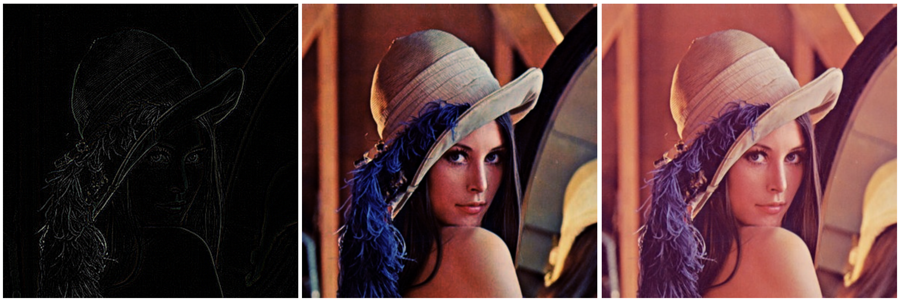

# Fundus.js

High-resolution images can be processed efficiently in browsers.

## Attention

1. Install `WebAssembly`.
2. Run `compile` before `test`.
3. Dont `new` too much at a time.
4. Many effects are still under development.

## Usage

```javascript
var f = new Fundus(canvasId, imageUrl, wasmUrl);
f.mat3Convolution([0,-1,0,-1,4,-1,0,-1,0]);  // webgl only, edge detection
f.histEqualization();  // webgl with webassembly
f.reset();
```
